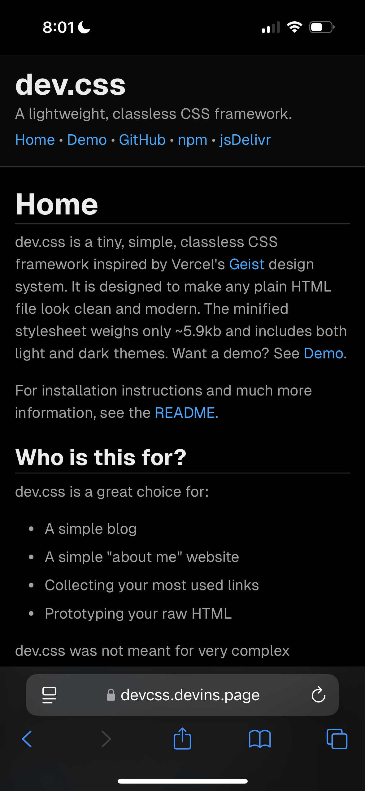

# intergrav/dev.css

[](https://www.npmjs.com/package/@intergrav/dev.css) [](https://cdn.jsdelivr.net/npm/@intergrav/dev.css/) [](https://discord.gg/m5tUgaM3uK) [](https://github.com/intergrav/dev.css)

dev.css is a tiny, simple, classless CSS framework inspired by Vercel's [Geist](https://vercel.com/geist) design system. It is designed to make any plain HTML file look clean and modern. The minified stylesheet weighs only **~5.5kb** and includes both light and dark themes.

You can find the website at <a href="https://devcss.devins.page">devcss.devins.page</a>, which contains a demo page.

<details>
<summary>Click to view preview</summary>



</details>

## Who is this for?

dev.css is a great choice for:

- A simple blog
- A simple "about me" website
- Collecting your most used links
- Prototyping your raw HTML

dev.css was not meant for very complex websites. An example of a site that uses dev.css is [SkywardMC's wiki](https://skywardmc.org).

## Importing

To use dev.css in your HTML, simply add the following line to the `<head>` section of your HTML file:

```html
<link
	rel="stylesheet"
	href="https://cdn.jsdelivr.net/npm/@intergrav/dev.css@4"
/>
```

You can also load a font from [intergrav/fonts](https://github.com/intergrav/fonts#readme) (or anywhere else) if you'd like a consistent font. Geist and Inter fonts work with dev.css out of the box, other fonts will require a theme to be used. If these fonts are not available, the default system/browser sans-serif and monospace fonts will be used, such as Microsoft's Segoe UI or Apple's San Francisco.

## Elements and Structure

dev.css takes advantage of semantic HTML elements. Here are some guidelines on how to use them for the best results.

### Header

It's recommended that you add a header to your page. To add one, place a `<header>` tag at the top of your `<body>`. You can use an `<h1>` tag as your website's title. You can also add a `<p>` element as an optional short description of the site.

If you want to add a traditional navigation element, you should lay out your `<nav>` element like this:

```html
<header>
	<h1>Website Title</h1>
	<p>An optional description of the website.</p>
	<nav>
		<ul>
			<li><a href="https://example.com">Demo</a></li>
			<li><a href="https://example.com">GitHub</a></li>
			<li><a href="https://example.com">npm</a></li>
			<li><a href="https://example.com">jsDelivr</a></li>
		</ul>
	</nav>
</header>
```


If you'd like, you could instead use [breadcrumb navigation](https://en.wikipedia.org/wiki/Breadcrumb_navigation). If you're using the header-oneline addon while doing this, it's recommended to remove all other elements in the header and move `<h1>` to `<main>`.

```html
<header>
	<nav>
		<a href="../..">dev.css</a> / <a href="..">Blog</a> / Making a Website
	</nav>
	<h1>Making a Website</h1>
	<p>Making a basic website with dev.css.</p>
</header>
```


### Main

For your main content, or the actual content of the page, it is heavily recommended that you wrap all of it in a `<main>` tag. Otherwise, certain features from dev.css may not work properly. It may also benefit search engine optimization. Here's an example:

```html
<main>
	<h1>Page 1</h1>
	<p>Welcome to my website's first page! This is an example.</p>
</main>
```

### Sidebar

Optionally, you can add a sidebar to your page for pretty much anything you'd like. A good usage for this could be, for example, complex navigation on a docs website, where you wouldn't be able to fit it all into the header. The sidebar will sort normally with the rest of the content on smaller screens. To make a sidebar, place an `<aside>` tag. You must put it above the `<main>` content. Here's an example:

```html
<aside>
	<h1>Sidebar</h1>
	<nav>
		<ul>
			<li><a href="https://example.com">Page 1</a></li>
			<li>
				<a href="https://example.com">Page 2</a>
				<ul>
					<li><a href="https://example.com">Page 2.1</a></li>
					<li><a href="https://example.com">Page 2.2</a></li>
				</ul>
			</li>
			<li><a href="https://example.com">Page 3</a></li>
			<li><a href="https://example.com">Page 4</a></li>
		</ul>
	</nav>
</aside>
```

### Footer

Optionally, you can add a footer to your page. This could include copyright information, what the website was built with, it's source link, anything really. To make a footer, place a `<footer>` tag at the bottom of your `<body>`. It also formats the nav element in the same way that the header does.

### Final Structure

In the end, this is what your page structure should look like if you decide to add everything:

```html
<html>
	<head>
		...
	</head>
	<body>
		<header>...</header>
		<aside>...</aside>
		<main>...</main>
		<footer>...</footer>
	</body>
</html>
```

### Text

Wrap all body text in `<p>` tags, unless it's the sole child of another element. Use the `<blockquote>` tag for quotes. To highlight text, wrap it in the `<mark>` tag. For code, use `<code>` for short inline code snippets and wrap that with `<pre>` for code blocks. Use `<kbd>` for keyboard input.

### Button

To create a link button, wrap the button in an `<a>` tag. Here's an example:

```html
<a href="https://example.com">
	<button>Click me!</button>
</a>
```

### Details

The `<details>` element can be used to create a toggle-able dropdown without using any JavaScript. Here's an example:

```html
<details>
	<summary>Click me!</summary>
	<p>Lorem ipsum dolor sit amet.</p>
</details>
```

### More

To learn about other HTML elements and how to write HTML, visit [W3Schools/html](https://www.w3schools.com/html/).

## Addons

dev.css provides a basic set of styles. Addons are small CSS or JS snippets that can be used to adjust or add functionality to dev.css based on your needs. Here are the built-in addons.

### `header-oneline.css`

This addon makes the header much more compact on narrow viewports. To use, add the following line after the `dev.css` import:

```html
<link
	rel="stylesheet"
	href="https://cdn.jsdelivr.net/npm/@intergrav/dev.css@4/addon/header-oneline.min.css"
/>
```

### `header-sticky.css`

This addon makes the header sticky, always staying at the top of the screen. Note that this addon is recommended for small headers, as it may affect the usability of your site if the header is large and takes up a lot of space. If using with `header-oneline.css`, place this after. To use, add the following line after the `dev.css` import:

```html
<link
	rel="stylesheet"
	href="https://cdn.jsdelivr.net/npm/@intergrav/dev.css@4/addon/header-sticky.min.css"
/>
```

### `scroll-to-top.js`

This addon creates a small "scroll to top" button in the bottom right corner of your website when the user scrolls down. The button uses the default dev.css button style. The button is slightly opaque so that you can see it but it doesn't block the view. To use this addon, add the following line after the `dev.css` import:

```html
<script
	src="https://cdn.jsdelivr.net/npm/@intergrav/dev.css@4/addon/scroll-to-top.min.js"
	defer
></script>
```

## Themes

dev.css supports custom colors and fonts through themes. You can find some pre-made themes in the `/theme` folder. To use a theme, simply apply it after the dev.css stylesheet. There are night and day themes, a set of Catppuccin themes, and a terminal theme. For example, to apply the terminal theme, add the following line after the `dev.css` import:

```html
<link
	rel="stylesheet"
	href="https://cdn.jsdelivr.net/npm/@intergrav/dev.css@4/theme/terminal.user.min.css"
/>
```

If you are creating your own theme, it is recommended to use the `boilerplate-auto.css` rather than the `boilerplate.css` template for better accessibility.

### Userstyles

The built-in themes can also be installed to your userstyle manager, such as Stylus. That theme will override any website using dev.css. To install one, open the theme's file in your browser.

## Credits

- [xz/new.css](https://github.com/xz/new.css) being a major inspiration for this project
- Vercel's [Geist](https://vercel.com/geist/introduction) design system
- [Catppuccin](https://github.com/catppuccin) for the colors used in the Catppuccin themes
